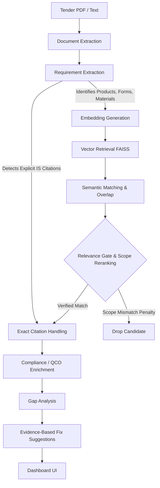

# BharatStandards.AI

## 1. Project Overview

BharatStandards.AI is an AI-assisted procurement specification analysis prototype designed for government and enterprise procurement teams. It automates the extraction of technical requirements from tender documents and recommends relevant Indian Standards (IS). 

The prototype addresses the critical gap in public procurement where drafting technical specifications requires extensive manual research across thousands of BIS standards. This prototype provides an end-to-end local pipeline that extracts products, materials, and forms from input text, semantically retrieves candidate standards, filters them via strict scope-aware reranking, and surfaces compliance considerations like Quality Control Orders (QCO) and mandatory certifications.

---

## 2. Problem Statement

Drafting and verifying technical tender specifications against official Indian Standards is a complex, error-prone, and manual process. 
- **Standard Discovery:** Procurement officers struggle to identify the correct standard for a specific product form or material out of over 20,000+ BIS standards.
- **Scope Mismatches:** Searching by keyword often yields standards for the correct material but the wrong product form (e.g., retrieving a "Steel Bars" standard when procuring "Steel Pipes").
- **Complex Requirements:** Tenders frequently bundle multiple products into a single clause, leading to cross-contamination of standards.
- **Traceability:** Manual audits lack direct evidence linking a requested parameter to a specific clause in an official standard.
- **Compliance Visibility:** Missing critical QCO notifications or mandatory ISI mark requirements can lead to illegal procurements.

---

## 3. Solution

BharatStandards.AI provides an automated, locally-hosted NLP and vector-search pipeline. 



---

## 4. End-to-End Workflow

### Step 1 — Input
The user uploads a tender PDF or inputs raw text describing the procurement requirements.

### Step 2 — Document Extraction
The system parses the document into clauses, removing generic administrative headers and isolating technical blocks.

### Step 3 — Requirement Understanding
The `RuleBasedRequirementExtractor` isolates independent products. It detects specific material constraints (e.g., "steel", "plastic") and product forms (e.g., "pipe", "bar", "helmet") to build isolated `ExtractedRequirement` objects.

### Step 4 — Standard Retrieval
The text is embedded using a local Sentence-Transformers model (`all-mpnet-base-v2`) and queried against an offline FAISS vector index of BIS standards.

### Step 5 — Matching
Candidates are scored based on a hybrid weighting of semantic similarity (cosine distance) and keyword/title overlap.

### Step 6 — Relevance Filtering & Scope Reranking
Candidates must pass a base `0.45` relevance threshold. The Reranker applies a **Scope Conflict Penalty**: if the requirement strictly specifies a form (e.g., "pipe"), and the candidate's metadata proves incompatible (e.g., only mentions "bar"), the candidate's score is clamped below the threshold to reject it.

### Step 7 — Exact Citation
If the tender explicitly cites a standard (e.g., "IS 8112:2013"), the system bypasses semantic thresholds, directly looks up the standard, and elevates it to `EXACT_CITATION` status.

### Step 8 — Compliance Enrichment
Candidates are enriched with local QCO (Quality Control Order) and mandatory certification mappings.

### Step 9 — Evidence
Every recommendation includes provenance (Match Reasons), explaining exactly *why* the standard was recommended (e.g., semantic similarity, shared keywords, or exact citation).

### Step 10 — Gap Analysis
The system cross-references the extracted technical parameters against the expected parameters for that standard.

### Step 11 — Fix Suggestions
If a requirement is poorly specified or references a withdrawn standard, a deterministic fixer provides suggested text revisions.

### Step 12 — Dashboard
Results are presented in a vanilla HTML/JS dashboard via a FastAPI backend.

---

## 5. AI / ML Architecture

This prototype uses a **hybrid deterministic and embedding-based architecture** that runs entirely locally.

- **Embedding Model:** `sentence-transformers/all-mpnet-base-v2` (768 dimensions).
- **Vector Index:** FAISS (Flat L2 index for exact nearest neighbor search).
- **Retrieval:** The query is embedded and the top-K candidates are retrieved from FAISS.
- **Reranking:** The `Reranker` calculates a weighted `System Match Score` using:
  - Semantic similarity (60%)
  - Keyword overlap (20%)
  - Product match (10%)
  - Sector match (5%)
  - Scope relevance (5%)
- **Scope/Form Compatibility (Hard Negative):** A deterministic regex-based filter evaluates form/material compatibility and applies a heavy penalty for scope mismatches to prevent false positives within the same material family.

---

## 6. Requirement Extraction

The extraction layer explicitly isolates the following from input text:

| Field | Example |
|---|---|
| Product | Steel Pipes |
| Category | Metal |
| Form | pipe |
| Material | steel |
| Explicit IS | IS 1786:2008 |
| Technical Parameters | `{"measurements": [{"value": "10", "unit": "mm"}], "grade": ["43"]}` |

**Limitations:** The extractor is currently a sophisticated deterministic heuristic (`RuleBasedRequirementExtractor`) relying on standard regex vocabulary parsing rather than an LLM, ensuring speed but limiting complex NLP relationship extraction.

---

## 7. Standard Recommendation Engine

Recommendations are categorized into system verification states:
- **EXACT CITATION:** The user explicitly typed an IS number that exists in the database.
- **DIRECT MATCH:** The system matched the query to a standard with a high confidence score.
- **NOT VERIFIED:** No candidate passed the relevance and scope thresholds.

---

## 8. Knowledge Base

The system operates on an offline, localized knowledge base of Indian Standards.

| File | Purpose | Count |
|---|---|---|
| `bis_metadata.json` | Core standard details, titles, keywords, scopes. | 584 records |
| `bis_compliance.json` | Compliance data (mandatory marks, sectors). | 585 records |
| `qco_mapping.json` | Mappings of IS numbers to Quality Control Orders. | 201 records |
| `normative_graph.json` | Graph of related/referenced standards. | 14 relationships |
| `sources.json` | Provenance tracking for evidence generation. | 603 records |

---

## 9. Evidence & Provenance

Every recommendation includes `match_reasons`. The system never outputs a "black box" score. 
Example Evidence output:
`["Semantic similarity 0.58 between the requirement and the standard's public metadata.", 'Shared keyword/title terms: bar, steel.']`

---

## 10. QCO & Certification

The prototype enriches results with local QCO status (e.g., "Under Mandatory Certification"). 
**Disclaimer:** This is system-provided evidence from the offline knowledge base. It requires human verification against official, latest BIS notifications before procurement use.

---

## 11. Gap Analysis

The system currently detects:
- **Unverified Exact Citation:** A cited standard was not found in the local KB.
- **Missing Core Parameters:** A standard requires a specific grade or measurement that the user failed to specify.
- **Vague Requirement:** The user provided fewer than 3 words, lacking technical specificity.

---

## 12. AI Fixer

The fixer provides deterministic draft revisions.
**Real Example:**
- Input: "Supply Cement"
- Fixer Suggestion: `"Consider specifying the exact grade and IS number (e.g., Supply 43 Grade Ordinary Portland Cement conforming to IS 8112:2013)."`

---

## 13. Real Demo Example

**Input:** `"Supply 43 Grade Ordinary Portland Cement conforming to IS 8112:2013."`

1. **Extraction:** Product: `Cement`, Form: `cement`, Explicit Citation: `IS 8112:2013`.
2. **Recommendation:** `[IS 8112:2013] Ordinary Portland Cement, 43 Grade` (Score: 0.93).
3. **Evidence:** `"MATCH TYPE: EXACT_CITATION — standard explicitly cited in tender and verified in local knowledge base."`

---

## 14. Difficult / Adversarial Cases

The test matrix handles adversarial cases to prove the architecture:
- **Scope Mismatch:** `"Supply steel pipes."` -> Rejects `IS 1786` (Steel Bars) due to form conflict, evaluating as `NOT_VERIFIED`.
- **Multi-Product Safe Split:** `"Supply steel pipes, electrical panels and safety helmets."` -> Successfully splits into 3 isolated requirements to prevent cross-contamination.
- **Unknown Input:** `"Unknown industrial machine."` -> Safely evaluates as `NOT_VERIFIED` rather than hallucinating a random standard.

---

## 15. Frontend

The frontend is a lightweight Vanilla JS and HTML application served directly by FastAPI.
- **Dashboard Structure:** Hero section, Analysis Input (Text/PDF), Requirements View, Standards Catalog, Analytics.
- **API Connection:** Connects dynamically to `/api/v1/*` using standard `fetch()`.

---

## 16. Backend API

| Method | Endpoint | Purpose |
|---|---|---|
| POST | `/api/v1/analyze` | End-to-end text analysis and extraction. |
| POST | `/api/v1/extract` | Extract entities/parameters only. |
| POST | `/api/v1/search` | Search standards database. |
| POST | `/api/v1/audit` | Run compliance audit/gap analysis. |
| GET | `/api/v1/standards/{is}` | Retrieve details for a specific standard. |

---

## 17. Project Structure

```
BharatStandards.AI/
├── Backend/
│   ├── app/
│   │   ├── api/          # FastAPI Routes (endpoints, auth, history)
│   │   ├── core/         # Logging, config, security
│   │   ├── data_layer/   # Repositories for KB JSON files
│   │   ├── models/       # Pydantic Schemas (schemas.py)
│   │   └── services/     # Core Logic (extractor, reranker, vector_db)
│   ├── data/             # Offline JSON Knowledge Base & FAISS index
│   └── tests/            # 121 Pytest unit/integration tests
├── Frontend/             # Vanilla HTML/JS Dashboard
│   ├── index.html
│   ├── app.js
│   └── styles.css
├── requirements.txt
└── README.md
```

---

## 18. Technology Stack

| Layer | Technology | Usage |
|---|---|---|
| Backend | FastAPI (Python) | High-performance REST API |
| Embeddings | Sentence-Transformers | Local vector representation |
| Vector Search | FAISS | Fast candidate retrieval |
| Data | JSON | Local Knowledge Base |
| Frontend | Vanilla JS / HTML | Lightweight dashboard UI |
| Testing | Pytest | Test suite (121 tests) |

---

## 19. Installation

**Prerequisites:** Python 3.10+ (Windows supported).

1. **Clone the repository.**
2. **Setup Virtual Environment:**
   ```powershell
   cd Backend
   python -m venv .venv
   .venv\Scripts\activate
   ```
3. **Install Dependencies:**
   ```powershell
   pip install -r requirements.txt
   ```

*(Note: The Frontend requires no separate build tools like npm/React; it is served directly by the backend).*

---

## 20. Running the Prototype

1. **Start the FastAPI Backend (which also mounts the frontend):**
   ```powershell
   cd Backend
   .venv\Scripts\uvicorn app.main:app --host 127.0.0.1 --port 8000
   ```
2. **Access the Dashboard:**
   Open your browser to `http://127.0.0.1:8000/`.

3. **Analyze a Requirement:**
   Type a technical specification in the dashboard and click "Run Full Analysis".

---

## 21. Testing

The backend includes a comprehensive, fully passing test suite.

- **Total Tests:** 121
- **Passed:** 121
- **Failed:** 0
- **Execution:** Run using `pytest tests/` from the `Backend` directory.
- **Coverage includes:** Extractor logic, scope reranking, FAISS retrieval, relevance gating, multi-product splitting, and API endpoints.

---

## 22. Known Limitations

- **Local Knowledge Base:** The dataset contains ~584 standards. It is not a real-time mirror of the 20,000+ BIS standards database.
- **Heuristic Extraction:** Requirement extraction relies on robust regex patterns and predefined vocabularies. It does not currently use an LLM for extraction, limiting its ability to resolve complex natural language relationships.
- **PDF Parsing:** Basic PyPDF text extraction is implemented, which may struggle with complex tables or corrupted PDFs.
- **Offline Data:** QCO statuses and amendments are static in this prototype and do not auto-update from government servers.

---

## 23. Prototype vs Production

| Area | Prototype | Production Requirement |
|---|---|---|
| Knowledge Base | Static ~584 records | Complete 20,000+ real-time database |
| Data Updates | Manual JSON files | Automated synchronization with BIS API |
| OCR | Basic PyPDF2 text extraction | Advanced Vision-Language Models (VLM) for tables |
| Authentication | Simulated JWT local auth | Enterprise SSO (OAuth2 / SAML) |
| Extraction | High-speed Regex/Heuristic | Fine-tuned LLM / NLP pipelines |

---

## 24. SIH Problem Statement Mapping

This prototype directly addresses the Smart India Hackathon problem by:
1. **Automating Standard Discovery:** Translating free-text requirements into specific IS codes.
2. **Improving Procurement Accuracy:** Checking for mandatory QCO requirements.
3. **Reducing Ambiguity:** Providing an AI fixer to suggest missing technical parameters (grades, tests).

---

## 25. Why This Prototype Matters

BharatStandards.AI provides **structured, evidence-based decision support**. It shifts standard discovery from manual keyword searching to semantic analysis. Crucially, by mapping recommendations strictly to provenance and explicit match reasons, it ensures that procurement officers maintain final authority backed by technical evidence.

---

## 26. Demo Script

**Duration:** 2 Minutes

1. **Start:** Open `http://127.0.0.1:8000/`.
2. **Show Interface:** "This is the BharatStandards.AI dashboard, integrating a FastAPI backend with a local FAISS vector search."
3. **Run Multi-Product Test:** Enter `"Supply steel pipes, electrical panels and safety helmets."` Click Analyze.
4. **Show Extraction:** "Notice how the system correctly splits the text into 3 isolated requirements to prevent cross-contamination."
5. **Show Scope Penalty:** "Notice how 'Steel Pipes' did not mistakenly recommend 'Steel Bars' because our Scope-Aware Reranker detected the form mismatch and penalized it."
6. **Show Exact Match:** Clear text. Enter `"Supply 43 Grade Cement conforming to IS 8112:2013."` Click Analyze.
7. **Show Evidence:** "The system instantly recognizes the exact citation, pulls the QCO compliance data, and highlights the match reason."

---

## 27. Future Scope

- **Enterprise Authentication:** Implementation of OAuth2 for secure government deployments.
- **Automated Data Refresh:** Webhook integration for real-time synchronization of QCO and amendment data.
- **Advanced OCR Pipeline:** Integrating Tesseract/EasyOCR for scanned historical tender documents.
- **Multi-lingual Support:** Allowing requirements to be analyzed in Hindi and other regional languages.

---

## 28. Responsible Use

BharatStandards.AI is an AI-assisted **decision-support system**. 
*System Match Scores*, recommendations, and compliance indicators (like QCO statuses) reflect the state of the local knowledge base. All results **must be verified** against the latest applicable official BIS notifications, amendments, and procurement rules by a qualified human officer before actual tender publication.

---

## 29. License / Credits

No license has currently been specified.
